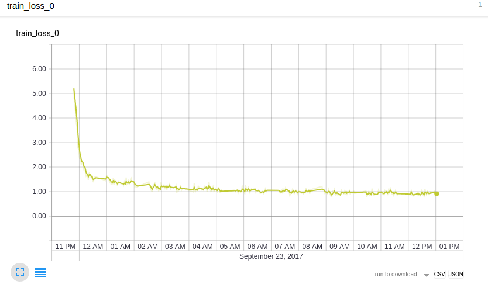

# chinese_im2text.pytorch

This project is based on ruotian's [neuraltalk2.pytorch](https://github.com/ruotianluo/neuraltalk2.pytorch).

## Requirements

### Software enviroment
Python 2.7 (because there is no [coco-caption](https://github.com/tylin/coco-caption) version for python 3), PyTorch 0.2 (along with torchvision). 

### Dataset
You need to download pretrained resnet model for both training and evaluation, and you need to register the ai challenger, and then download the training and validation dataset.

## Pretrained models

TODO

## Train your own network on AI Challenger
### Download AI Challenger dataset and preprocessing
First, download the 图像中文描述数据库 from [link](https://challenger.ai/datasets). We need training images (210,000) and val images (30,000). You should put the `ai_challenger_caption_train_20170902/` and `ai_challenger_caption_train_20170902/` in the same directory, denoted as `$IMAGE_ROOT`. Once we have these, we can now invoke the `json_preprocess.py` and `prepro_ai_challenger.py` script, which will read all of this in and create a dataset (two feature folders, a hdf5 label file and a json file).

```bash
$ python scripts/json_preprocess.py
$ python scripts/prepro_ai_challenger.py
```

`json_preprocess.py` will first transform the AI challenger Image Caption_json to mscoco json format. Then map all words that occur <= 5 times to a special `UNK` token, and create a vocabulary for all the remaining words. The image information and vocabulary are dumped into `coco_ai_challenger_raw.json`.

`prepro_ai_challenger.py` extract the resnet101 features (both fc feature and last conv feature) of each image. The features are saved in `coco_ai_challenger_talk_fc.h5` and `coco_ai_challenger_talk_att.h5`, and resulting files are about 359GB.


### Start training
The following training procedure are adopted from ruotian's project, and if you need REINFORCEMENT-based approach, you can clone from [here](https://github.com/ruotianluo/self-critical.pytorch). For ai challenger, they provide large number of validation size, you can set `--val_images_use` to a bigger size.

```bash
$ python train.py --id st --caption_model show_tell --input_json data/cocotalk.json --input_fc_h5 data/coco_ai_challenger_talk_fc.h5 --input_att_h5 data/coco_ai_challenger_talk_att.h5 --input_label_h5 data/coco_ai_challenger_talk_label.h5 --batch_size 10 --learning_rate 5e-4 --learning_rate_decay_start 0 --scheduled_sampling_start 0 --checkpoint_path log_st --save_checkpoint_every 6000 --val_images_use 5000 --max_epochs 25
```

The train script will dump checkpoints into the folder specified by `--checkpoint_path` (default = `save/`). We only save the best-performing checkpoint on validation and the latest checkpoint to save disk space.

To resume training, you can specify `--start_from` option to be the path saving `infos.pkl` and `model.pth` (usually you could just set `--start_from` and `--checkpoint_path` to be the same).

If you have tensorflow, the loss histories are automatically dumped into `--checkpoint_path`, and can be visualized using tensorboard.

The current command use scheduled sampling, you can also set scheduled_sampling_start to -1 to turn off scheduled sampling.

If you'd like to evaluate BLEU/METEOR/CIDEr scores during training in addition to validation cross entropy loss, use `--language_eval 1` option, but don't forget to download the [coco-caption code](https://github.com/tylin/coco-caption) into `coco-caption` directory.

For more options, see `opts.py`. 

I am training this model with stack-captioning, and the training loss is as follows:


Some predicted descriptions are as follows (image xxx, xxx is the image ID):
```bash
Beam size: 5, image 2550: 一个穿着裙子的女人走在道路上
Beam size: 5, image 2551: 房间里有一个穿着白色上衣的女人在给一个
Beam size: 5, image 2552: 一个穿着黑在衣服的女人站廊里的台阶步
Beam size: 5, image 2553: 舞台上有一个人旁有一个套的女人在看一个
Beam size: 5, image 2554: 房间里有一个戴着眼镜的女人在吃饭
Beam size: 5, image 2555: 一个戴着帽子的男人牵着一个戴着帽子的孩子走在雪雪雪地上
Beam size: 5, image 2556: 一个戴着帽子的男人和一个戴着着包的女人走在道路上
Beam size: 5, image 2557: 两个人往的人群的运动服的男人在道
Beam size: 5, image 2558: 两个戴着帽子的男人和一个戴着帽子的男人站在道路上
Beam size: 5, image 2559: 一个穿着运动服穿着运动服的女人在运动场上奔跑
Beam size: 5, image 2560: 屋子里有一个双手拿着手机的女人站在电脑里
Beam size: 5, image 2561: 一个双手拿着包的女人站在室里
Beam size: 5, image 2562: 一个穿着连衣穿着裙子的女人在舞台上
Beam size: 5, image 2563: 舞台上两个人的男人有一个人的旁边有一个右拿话筒的男人在讲话
Beam size: 5, image 2564: 一个穿着白色衣服的女人站在房屋门口
Beam size: 5, image 2565: 舞台上有两个穿着红在表演
Beam size: 5, image 2566: 一个戴着帽子的男人在球场的人在高尔着球场上打高尔夫球
Beam size: 5, image 2567: 一个人旁边的男人旁有一个拿着话筒的男人和一个光照射的室外
Beam size: 5, image 2568: 一个双手拿着奖杯的男人站在广告牌子的女人站在广告牌前
Beam size: 5, image 2569: 室内有一个人旁有一个双手拿着上衣的男人在给一个穿着深色上衣子
Beam size: 5, image 2570: 运动场的前面有两个穿着运动场上打冰球
Beam size: 5, image 2571: 两个穿着球衣的运动场在球员上奔跑在球场上
Beam size: 5, image 2572: 一个穿着裙子的女人在T台上走秀
Beam size: 5, image 2573: 宽敞的草地上有三个戴着帽子的男人在骑马
Beam size: 5, image 2574: 舞台上一个人的女人和一个女人在表演
Beam size: 5, image 2575: 一个人旁边边有一个人的孩子的女人站在室内
Beam size: 5, image 2576: 一个穿着黑色衣服的男人和一个穿着黑色衣服的人站廊路
Beam size: 5, image 2577: 屋子里有一个的女人的前面有一个右手拿着话筒的女人
Beam size: 5, image 2578: 一个人旁边的女人旁有一个孩子的女人抱着一个孩和一个孩里有一个穿着
Beam size: 5, image 2579: 房屋外有一个的女人旁边有一个左手里的女人在行
Beam size: 5, image 2580: 一个戴着墨镜的男人和一个戴着墨镜的男人走在大厅里
Beam size: 5, image 2581: 运动场的运动服的女人在干净的道路上跳舞
Beam size: 5, image 2582: 一个右手拿着包的女站在房屋前
Beam size: 5, image 2583: 屋子里有一个人旁边有一个戴着眼镜的男人在下围棋
Beam size: 5, image 2584: 车厢里有一个戴着眼镜的男人在给一个坐在车
Beam size: 5, image 2585: 两个的球场上有两个身穿运动的男人在球
Beam size: 5, image 2586: 舞台上有一个右手拿着话筒的女人在讲话
Beam size: 5, image 2587: 室内有一个人的男人的男人旁有一个戴着眼镜的男人坐在椅子上
Beam size: 5, image 2588: 一个右手拿着包的女人走在道路上
Beam size: 5, image 2589: 两个穿着球场的运动员在球场上打篮球
Beam size: 5, image 2590: 一个穿着红色裙子的女人站廊里的道路上
Beam size: 5, image 2591: 一个穿着黑色衣服的女人站在房间里
Beam size: 5, image 2592: 球场上的球场上有一个右手拿着球拍的女人在打网球
Beam size: 5, image 2593: 一个穿着裙起的女人的女人站在舞台上
Beam size: 5, image 2594: 两个穿着球衣的男人在宽阔的运动场上争抢足球
Beam size: 5, image 2595: 运动场上有两个膝着头发的女人在帮一个穿着短裤的女人
Beam size: 5, image 2596: 一个穿着运动服的男人在运动场上奔跑
Beam size: 5, image 2597: 房间里有一个穿着黑色衣服的男人在给一个躺在床上的女人
Beam size: 5, image 2598: 舞台上有一个右手拿着话筒的男人在和一个人在话筒的女人
Beam size: 5, image 2599: 一个穿着裙子的女人站在广告牌前的红毯上
```

## Generate image captions

### Evaluate on raw images
Now place all your images of interest into a folder, e.g. `blah`, and run
the eval script:

```bash
$ python eval.py --model model.pth --infos_path infos.pkl --image_folder blah --num_images 10
```

This tells the `eval` script to run up to 10 images from the given folder. If you have a big GPU you can speed up the evaluation by increasing `batch_size`. Use `--num_images -1` to process all images. The eval script will create an `vis.json` file inside the `vis` folder, which can then be visualized with the provided HTML interface:

```bash
$ cd vis
$ python -m SimpleHTTPServer
```

Now visit `localhost:8000` in your browser and you should see your predicted captions.

### Evaluate on validation split

```bash
$ python eval.py --dump_images 0 --num_images 5000 --model model.pth --infos_path infos.pkl --language_eval 1 
```

The defualt split to evaluate is test. The default inference method is greedy decoding (`--sample_max 1`), to sample from the posterior, set `--sample_max 0`.

**Beam Search**. Beam search can increase the performance of the search for greedy decoding sequence by ~5%. However, this is a little more expensive. To turn on the beam search, use `--beam_size N`, N should be greater than 1 (we set beam size to 5 in our eval).

## Acknowledgements

Thanks the original [neuraltalk2](https://github.com/karpathy/neuraltalk2), and the pytorch-based [neuraltalk2.pytorch](https://github.com/ruotianluo/neuraltalk2.pytorch) and awesome PyTorch team.

## Paper

1. Jiuxiang Gu, Gang Wang, Jianfei Cai, and Tsuhan Chen. ["An Empirical Study of Language CNN for Image Captioning."](https://arxiv.org/pdf/1612.07086.pdf) ICCV, 2017.
```
@article{gu2016recurrent,
  title={An Empirical Study of Language CNN for Image Captioning},
  author={Gu, Jiuxiang and Wang, Gang and Cai, Jianfei and Chen, Tsuhan},
  journal={ICCV},
  year={2017}
}
```
2. Jiuxiang Gu, Jianfei cai, Gang Wang, and Tsuhan Chen. ["stack-Captioning: Coarse-to-Fine Learning for Image Captioning."](https://arxiv.org/abs/1709.03376) arXiv preprint arXiv:1709.03376 (2017).
```
@article{gu2017stack_cap,
  title={Stack-Captioning: Coarse-to-Fine Learning for Image Captioning},
  author={Gu, Jiuxiang and Cai, Jianfei and Wang, Gang and Chen, Tsuhan},
  journal={arXiv preprint arXiv:1709.03376},
  year={2017}
}
```
